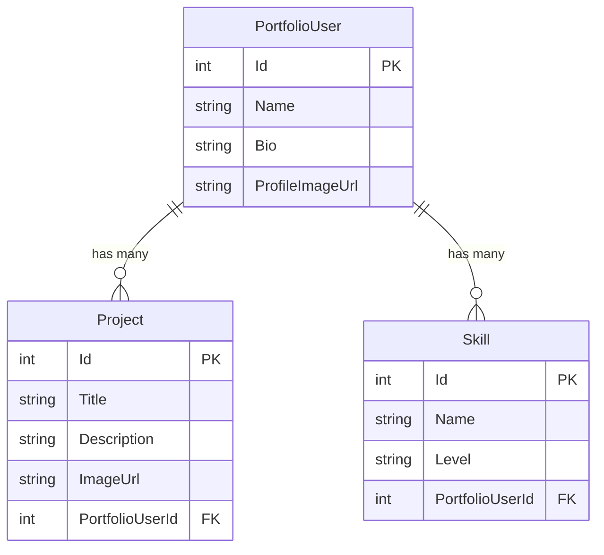

# SkillSnap - Portfolio Showcase Platform


A modern, full-stack portfolio showcase platform built with **.NET 9**, **Blazor WebAssembly**, and **Entity Framework Core**. This project demonstrates comprehensive full-stack development skills using Microsoft's modern web development stack.

## 🎯 Project Overview

SkillSnap is a portfolio platform that allows developers to showcase their skills, projects, and professional experience. It features a beautiful, modern UI with real-time data management and comprehensive CRUD operations.

### Key Features
- 👥 **Portfolio Management** - Create and manage developer profiles
- 🛠️ **Skills Showcase** - Display skills with proficiency levels and progress bars
- 📁 **Project Gallery** - Showcase projects with images and descriptions
- 🎨 **Modern UI** - Beautiful, responsive design with Tailwind CSS
- 📊 **Analytics** - Statistics and insights about portfolios and skills
- 🔍 **Search & Filter** - Find portfolios by name, skills, or projects

## 🏗️ Architecture

This project follows a **clean architecture** pattern with clear separation of concerns:

```
SkillSnap/
├── 📁 Client/          # Blazor WebAssembly Frontend
├── 📁 Server/          # ASP.NET Core Web API
├── 📁 Database/        # Entity Framework Context & Migrations
├── 📁 Shared/          # Shared Models & DTOs
└── 📄 SkillSnap.sln    # Solution File
```

### Technology Stack

| Layer | Technology | Purpose |
|-------|------------|---------|
| **Frontend** | Blazor WebAssembly | Interactive UI with C# |
| **Backend** | ASP.NET Core Web API | RESTful API services |
| **Database** | SQLite + Entity Framework Core | Data persistence |
| **Styling** | Tailwind CSS | Modern, responsive design |
| **State Management** | Blazor Components | Component-based architecture |

## 🚀 Getting Started

### Prerequisites

- [.NET 9 SDK](https://dotnet.microsoft.com/download/dotnet/9.0)
- [Visual Studio 2022](https://visualstudio.microsoft.com/) or [VS Code](https://code.visualstudio.com/)
- [Git](https://git-scm.com/)

### Installation

1. **Clone the repository**
   ```bash
   git clone https://github.com/yourusername/SkillSnap.git
   cd SkillSnap
   ```

2. **Restore dependencies**
   ```bash
   dotnet restore
   ```

3. **Update the database**
   ```bash
   cd Database
   dotnet ef database update
   cd ..
   ```

4. **Run the application**
   ```bash
   dotnet run --project Server
   ```

5. **Open your browser**
   Navigate to `https://localhost:7001` to view the application.

## 📚 Learning Objectives

This project demonstrates key concepts in **.NET Full-Stack Development**:

### Backend Development (.NET Core)
- ✅ **Entity Framework Core** - ORM and database management
- ✅ **ASP.NET Core Web API** - RESTful API development
- ✅ **Dependency Injection** - Service registration and lifetime management
- ✅ **Model Validation** - Data annotations and custom validation
- ✅ **Error Handling** - Global exception handling and logging
- ✅ **Database Migrations** - Schema versioning and updates

### Frontend Development (Blazor)
- ✅ **Blazor WebAssembly** - Client-side C# web applications
- ✅ **Component Architecture** - Reusable UI components
- ✅ **Data Binding** - Two-way data binding and state management
- ✅ **Routing** - Navigation and page routing
- ✅ **HTTP Client** - API communication and data fetching
- ✅ **Responsive Design** - Mobile-first, responsive layouts

### Database Design
- ✅ **Entity Relationships** - One-to-many relationships
- ✅ **Data Seeding** - Initial data population
- ✅ **Indexes** - Performance optimization
- ✅ **Constraints** - Data integrity and validation

### Modern Web Development
- ✅ **RESTful APIs** - Standard HTTP methods and status codes
- ✅ **JSON Serialization** - Data exchange format
- ✅ **CORS Configuration** - Cross-origin resource sharing
- ✅ **Modern CSS** - Tailwind CSS utility classes
- ✅ **Responsive Design** - Mobile and desktop compatibility

## 🗄️ Database Schema

The application uses a simple but effective database schema:



## 🔌 API Endpoints

### Portfolio Users
- `GET /api/PortfolioUsers` - Get all portfolio users
- `GET /api/PortfolioUsers/{id}` - Get specific user
- `POST /api/PortfolioUsers` - Create new user
- `PUT /api/PortfolioUsers/{id}` - Update user
- `DELETE /api/PortfolioUsers/{id}` - Delete user
- `GET /api/PortfolioUsers/search?name=john` - Search users

### Projects
- `GET /api/Projects` - Get all projects
- `GET /api/Projects/{id}` - Get specific project
- `POST /api/Projects` - Create new project
- `PUT /api/Projects/{id}` - Update project
- `DELETE /api/Projects/{id}` - Delete project
- `GET /api/Projects/by-user/{userId}` - Get user's projects

### Skills
- `GET /api/Skills` - Get all skills
- `GET /api/Skills/{id}` - Get specific skill
- `POST /api/Skills` - Create new skill
- `PUT /api/Skills/{id}` - Update skill
- `DELETE /api/Skills/{id}` - Delete skill
- `GET /api/Skills/by-level/{level}` - Get skills by level

## 🎨 UI Components

The application features several custom Blazor components:

### ProfileCard Component
- Displays user information with profile image
- Shows project and skill counts
- Interactive buttons for portfolio actions
- Responsive design with hover effects

### SkillTags Component
- Visual skill representation with progress bars
- Color-coded skill levels
- Star rating system
- Smooth animations and transitions

### ProjectList Component
- Grid layout for project showcase
- Image hover effects
- Project filtering and search
- Responsive card design

## 🛠️ Development Features

### Code Quality
- **Clean Architecture** - Separation of concerns
- **SOLID Principles** - Object-oriented design
- **Async/Await** - Non-blocking operations
- **Error Handling** - Comprehensive exception management
- **Validation** - Input validation and business rules

### Performance
- **Entity Framework Optimization** - Efficient queries
- **Lazy Loading** - On-demand data loading
- **Caching** - Response caching strategies
- **Compression** - Response compression

### Security
- **Input Validation** - XSS and injection prevention
- **CORS Configuration** - Cross-origin security
- **HTTPS** - Secure communication
- **Data Sanitization** - Clean data processing

## 📖 Learning Path

This project is designed for **.NET Full-Stack Developer** learning and covers:

### Beginner Level
1. **.NET Basics** - Understanding the .NET ecosystem
2. **C# Fundamentals** - Language features and syntax
3. **Entity Framework** - Database operations
4. **Blazor Components** - UI development

### Intermediate Level
1. **API Development** - RESTful service creation
2. **Database Design** - Schema and relationships
3. **Frontend Architecture** - Component patterns
4. **State Management** - Data flow and binding

### Advanced Level
1. **Performance Optimization** - Query optimization
2. **Error Handling** - Exception management
3. **Testing** - Unit and integration tests
4. **Deployment** - Production deployment strategies

## 🧪 Testing

The project includes comprehensive testing strategies:

```bash
# Run all tests
dotnet test

# Run with coverage
dotnet test --collect:"XPlat Code Coverage"
```

## 🚀 Deployment

### Development
```bash
dotnet run --project Server
```

### Production
```bash
dotnet publish -c Release -o ./publish
```

## 📝 Contributing

This is a learning project, but contributions are welcome:

1. Fork the repository
2. Create a feature branch
3. Make your changes
4. Add tests if applicable
5. Submit a pull request

## 📄 License

This project is licensed under the MIT License - see the [LICENSE](LICENSE) file for details.

## 🙏 Acknowledgments

- **Microsoft Learn** - .NET learning resources
- **Blazor University** - Blazor documentation and examples
- **Tailwind CSS** - Utility-first CSS framework
- **Entity Framework Core** - Microsoft's ORM

## 📞 Support

For questions or support regarding this learning project:

- 📧 Email: techer.arnaud@outlook.fr
- 📚 Documentation: [Microsoft Learn](https://learn.microsoft.com/)

---

**Happy Learning! 🎓**

*This project is part of a comprehensive .NET Full-Stack Developer learning path. Use it as a reference for building modern web applications with Microsoft's technology stack.*
